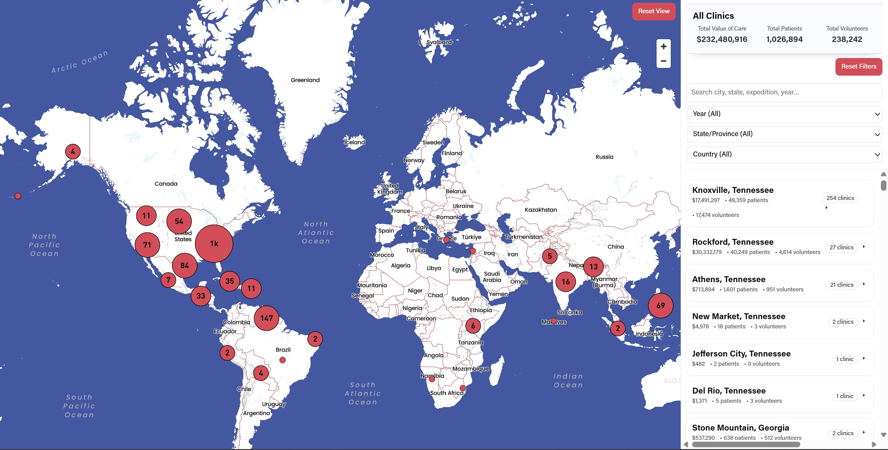

# RAM Impact Map System (Summary)

Geographic visualization system used on the Remote Area Medical website to display the organization's nationwide clinic impact.

The system converts operational clinic data stored in a CSV file into a GeoJSON dataset used by a WordPress plugin and Mapbox to render an interactive map.

## Technologies
- Python
- GitHub Actions
- GeoJSON
- Mapbox
- WordPress
- Google Analytics / GTM

The goal of the system is to allow non-technical staff to update geographic reporting data through a spreadsheet while keeping the website integration stable and automated.

# RAM Impact Map System (Dive Deeper)

This repository powers the **RAM Impact Map** displayed on the RAM website.
https://www.ramusa.org/our-impact/?

(or where ever somone uses the shortcode)

The Impact Map shows:
- Total clinics
- Geographic coverage
- Expedition data
- Search + filter functionality
- Interactive map experience
- GA4 engagement tracking

The website loads a GeoJSON dataset from this repository to render the map.

---

# How It Works (Simple Explanation)

1. A master spreadsheet (CSV file) contains all clinic data.
2. GitHub automatically converts that CSV into a GeoJSON dataset.
3. The GeoJSON file is stored in this repository.
4. The WordPress plugin loads that file.
5. Mapbox renders the map.
6. GTM/GA4 tracks user engagement.

There is:
- ❌ No database
- ❌ No server-side processing
- ❌ No hosting environment required

The system is file-based, automated, and stable.

---

# Folder Structure

/data  
- `Master_Clinic_ImpactMap.csv` (Source of truth and what we edit and update)

/scripts  
- `build_impactmap_geojson.py` (Converts CSV → GeoJSON)

/output  
- `ImpactMap_Dataset.geojson` (Used by website)

/.github/workflows
  - `build-impactmap.yml` (Automation)

/readme
- `technical.md` (technical reference for developers)
- `analytics.md` (events and parameter being used so does not get deleted by accident)
- `disaster recovery guide.md` (what to do if blows up)

- How to update data in map.md
  - Walks through how to update the map step by step
  
- README.md  
  - Overview documentation (that you are currently reading)

---

# 🔥 AUTOMATION (NEW SYSTEM)

When the CSV file inside `/data` is updated and committed:

GitHub Actions automatically:

1. Runs the Python script
2. Generates a new GeoJSON file
3. Commits the updated GeoJSON into `/output`

All updates are processed automatically via GitHub Actions.
To verify a build completed successfully, check the "Actions" tab for a green checkmark.

No one needs to install Python.
No one needs to run command prompt.
No one needs local development tools.

This is fully automated.

---

# Most Important Rule

The only file the website uses is:

`output/ImpactMap_Dataset.geojson`

If that file is correct and accessible, the map will work.  If you rename it something else it will break the map on the website.

---

# Where the Map Lives

The map is rendered via a WordPress plugin using a shortcode.

The GeoJSON is loaded from:

https://raw.githubusercontent.com/ITDeptAdmin/ImpactMap/main/output/ImpactMap_Dataset.geojson

If this URL works in a browser, the map will load.

---

# Mapbox Token

The Mapbox public token is stored in:

`ram-impact-map.php`

Public tokens start with:
`pk.eyJ...`

If the map ever fails to render tiles, check the token.

---

# System Safety

Because the system is file-based:

- If something breaks, revert to a previous GitHub commit.
- No database corruption is possible.
- No server outage risk from this system.

This is intentionally designed to be simple and resilient.
